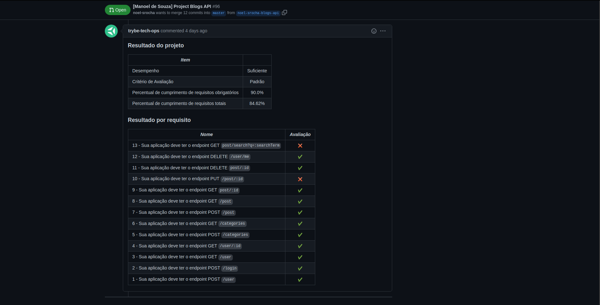

# Project Blog API

### The Assignment

You will architect and develop a blog post CRUD API (with Sequelize). Starting with the API, you will develop some endpoints (following REST principles) that will be connected to your database.

First, you will create a table for users who want to register in the application. After that, you will also create a Categories table for your Posts and finally the Posts table will be your focus, keeping all the information of the posts made on the platform.

### Skills to be Tested 

In this project, I was able to build a backend using `ORM` with the `sequelize` package from `npm`, and you will be able to:
 - Create and join tables using `models` from `sequelize`
 - Build endpoints to consume the models you create
 - Make a `CRUD` with the `ORM`

### Evaluator Results

#### Disclaimer

This assignment was developed by [Trybe](https://www.betrybe.com) in order to test my skills using ORMs, in this case _Sequelize_, to assist in REST API development connected to MySQL.